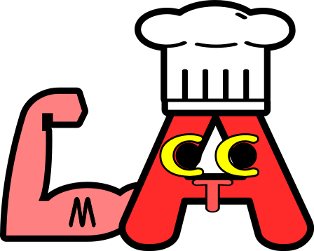

# SFCS_Project-CoLamThiMoiCoAn

## Thông báo:
- Mọi người vào github để xem lại thông báo của nhóm nếu quên.
- Link làm class diagram cho cả team: https://app.lucidchart.com/invitations/accept/a562471d-e741-43d5-9173-85cb55e9dfa0  (mn sửa phần mình trong project đó cho dễ theo dõi) ---> nhớ căn method cho nhất quán với method sử dụng trong sequence diagram (chú ý: mỗi entity trong sequence tương ứng với 1 class, method được sử dụng phải có sẵn trong class)
+ link lucid chart đó có chức năng lưu phiên bản với back up như git đó, chỉnh sửa gì đánh dấu phiên bản đó cho dễ nhớ
- Link làm luồng màn hình: https://www.figma.com/files/project/10159965/SFCS (vào đúng phần mình để làm, dùng lại mấy object của cook dựng sẵn cho mau)

## Chức năng app
- Manager:

đăng nhập

### +xem báo cáo orders tất cả cửa hàng

tạo tài khoản vendor owner

xóa ...
- Venor owner:

+đăng nhập

### +xem báo cáo orders 1 cửa hàng

tạo tài khoản cook

xóa ...

/*thêm đồ ăn

sửa đồ ăn

xóa đồ ăn*/
- Cook:

đăng nhập

### + xem orders
### +chấp nhận orders
### +hoàn thành orders
### +Cật nhật tình trạng out of foods

- Customer:

đăng nhập

tạo tài khoản

### + xem  orders
### +Order thức ăn
=======
- Link làm luồng màn hình: https://www.figma.com/files/project/10410493/SFCS (vào đúng phần mình để làm, dùng lại mấy object của cook dựng sẵn cho mau) --> vào bằng tài khoản nhóm mới được (CoLamMoiCoAnSFCS@gmail.com, pass:sfcs12345)
-----------------THÔI TRỄ RỒI LÀM LUỒNG MÀN HÌNH BẰNG PPT CHO NHANH, XONG VẼ MẤY MŨI TÊN GIỐNG CHUYỂN MÀN HÌNH BÊN FIGMA------------------

T5 (18/6) họp team tại Hella Zone H6
>>>>>>> fa889822bf1f7af7cd8ae7b1fa86b11be36a8d42
